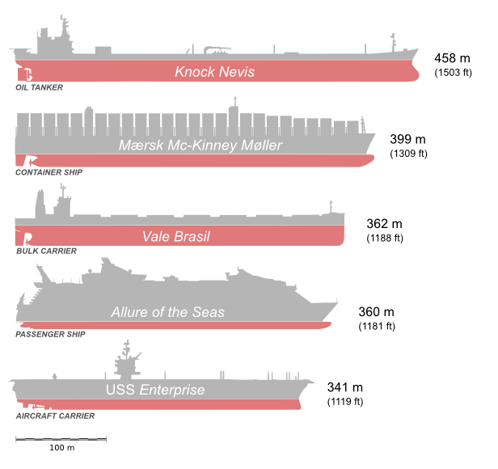

# Schiffe

*Schiffe: Wikimedia Commons; Delphine Ménard (notafish) CC BY SA 2.0*

## Ziel

Wichtige Eigenschaften aus Daten zu Schiffen zu ermitteln. Dabei werden wir einige Techniken zur **Datenaufbereitung** verwenden, **Clustern** und eine **Hauptkomponentenzerlegung** durchführen.

*Bei jeder Aufgabe winken **Lösungsbuchstaben**. Die Lösung hat 15 Buchstaben und hat auch mit Schiffen zu tun.*

### Aufgabe 1

Lies die Datei mit den größten Schiffen der Welt (`schiffe.csv`) mit `pandas` ein. Setze dabei den Index auf die Schiffsnamen.

[Quelle: Wikipedia](https://de.wikipedia.org/wiki/Liste_der_gr%C3%B6%C3%9Ften_Schiffe_der_Welt)

#### Lösungsbuchstabe 1: 

*Welches Schiff hat einen Tiefgang unter 3 Metern? (vorletzter Buchstabe des Schiffsnamens)*

----

### Aufgabe 2

Verschaffe Dir mit der Methode `df[SPALTE].value_counts()` einen Überblick über die Werte der Spalten *Art* und *Status*.

#### Lösungsbuchstabe 2:

*Welcher **Status** kommt am häufigsten vor? (erster Buchstabe)*

----

### Aufgabe 3

Verwende `pd.scatter_matrix(df)`, um mögliche Korrelationen zu sehen.

#### Lösungsbuchstabe 3:

*Welches der Histogramme auf der Diagonalen ähnelt am ehesten einer Normalverteilung? (letzter Buchstabe im Spaltennamen)*

----

### Aufgabe 4

Plotte die Länge der Schiffe gegen ihre Höhe als Streudiagramm.

**Erkennst Du mögliche Gruppen von Schiffen im Streudiagramm?**

#### Lösungsbuchstabe 4:

*Wie viele Punkte stehen bei ca. Länge 180m, Höhe 60m im Diagramm übereinander? (zweiter Buchstabe des Zahlworts)*

----

### Aufgabe 5

Einer der Einträge enthält einen **Datenfehler**. Untersuche die Diagramme auf Auffälligkeiten. Finde und behebe den Fehler in der CSV-Datei.

*Hinweis:* Probiere `df.hist()` aus, um die Daten zu untersuchen.

#### Lösungsbuchstabe 5:

*Wie heißt das Schiff mit dem Datenfehler? (vorletzter Buchstabe)*

----

### Aufgabe 6

Extrahiere aus dem *DataFrame* die Spalten **BRZ, DWT, Länge, Breite** und **Tiefgg**. Lösche *danach* mit `df.dropna()` die Einträge mit `NaN`-Werten aus der Tabelle.

Speichere das Ergebnis in einem *DataFrame* namens `subset`. Überprüfe mit `print(df.shape)` die Abmessungen des DataFrame. Das DataFrame sollte **22** Einträge enthalten.

#### Lösungsbuchstabe 6:

*Wie heißt das letzte Schiff in der Tabelle? (zweiter Buchstabe)*

----

### Aufgabe 7

Für die Weiterverarbeitung mit `scikit-learn` benötigen wir die Daten als NumPy-Array. Verwende das entsprechende Attribut des *DataFrame*, um ein NumPy-Array zu erhalten.

#### Lösungsbuchstabe 7:

*Wie heißt das Attribut mit dem NumPy-Array? (vorletzter Buchstabe)*

----

### Aufgabe 8

Clustere die Daten nach der **KMeans**-Methode in 4 Cluster:

    from ______.cluster import KMeans

    kmeans = KMeans(______=4, random_state=0)
    kmeans.______(______)
    print(______.labels_)

Setze in die Lücken ein: `fit`, `kmeans`, `n_clusters`, `sklearn`, `X`

#### Lösungsbuchstabe 8:

*Welches Wort gehört in letzte Lücke? (erster Buchstabe)*

----

### Aufgabe 9

Skaliere die Daten auf Werte zwischen 0 und 1. Wie das geht findest Du auf [http://scikit-learn.org](http://scikit-learn.org) im Abschnitt 

    4.3. Preprocessing data

Speichere das skalierte Array in einer Variablen.
Wiederhole das Clustern. Ändern sich die Cluster-Zuordnungen?

Mit folgendem Befehl kannst Du die Cluster im bereinigten DataFrame speichern:

    subset['cluster'] = pd.Series(kmeans.labels_, index=subset.index)

#### Lösungsbuchstaben 9+10:

*Welches ist das breiteste Schiff, das sich im gleichen Cluster wie die 'Ulysses' befindet? (4. und 3. Buchstabe von hinten)*

----

### Aufgabe 10

Färbe die Cluster ein. Damit der folgende Code läuft, benötigst Du eine Funktion `farbe_zuweisen(clusternr)`, die folgender Form entspricht:

    def farbe_zuweisen(clusternr):
        return "blue"

Die Funktion erhält die Cluster-Nummer von 0 bis 3 als Parameter `clusternr`. Erweitere `farbe_zuweisen` so daß sie je nach Zahl einen String mit der Farbe (`'blue', 'green', 'red'` oder `'orange'`) zurückgitb.

    colors = subset['cluster'].apply(farbe_zuweisen)
    subset.plot.scatter('Länge', 'Breite', subset['Länge']/10, c=colors)
    plt.savefig('clusters.png')

#### Lösungsbuchstaben 11+12:

*Die ersten beiden Buchstaben der in der letzten Programmzseile aufgerufenen Funktion.*

----

### Aufgabe 11

Als letztes führen wir eine **Hauptkomponentenzerlegung** durch. Damit können wir die Dimensionen unserer Daten reduzieren. Bei einer Hauptkomponentenzerlegung werden aus den vorhandenen Größen Vektoren ermittelt, die möglichst viel **Variabilität** der Daten abbilden.

Der folgende Code ermittelt zwei Hauptkomponenten. Es sind drei Fehler im Code enthalten. Bitte finde und behebe diese.

    pca = PCA(n_components=2)
    pca.fit(X)
    xpca = pca.transform(x)

    plt.figure{}
    plt.plot(xpca[:, 0], xpca[:, 1], 'ro')
    plt.savefig(hauptkomponenten.png)

#### Lösungsbuchstaben 13+14:

*Wofür steht die Abkürzung **PCA**? (2. und 3. Buchstabe)*

----

### Aufgabe 12

Wir können uns mit

    print(pca.components_)

die Beiträge der einzelnen Hauptkomponenten zu den einzelnen Merkmalen ansehen. Der folgende Code plottet die Beiträge als Heatmap:

    names = list(subset.columns)

    plt.figure()
    plt.matshow(pca.components_, cmap='viridis')
    plt.yticks([0, 1], ["1. Hauptkomponente", "2. Hauptkomponente"])
    plt.colorbar()
    plt.xticks(range(len(names)), names, rotation=60, ha='left')
    plt.xlabel('Merkmal')
    plt.ylabel('Hauptkomponente')
    plt.savefig('PCA_heatmap.png')

#### Lösungsbuchstabe 15:

*Welche Eigenschaft unserer Daten hat den stärksten Beitrag zur 2. Hauptkomponente? (dritter Buchstabe)*
